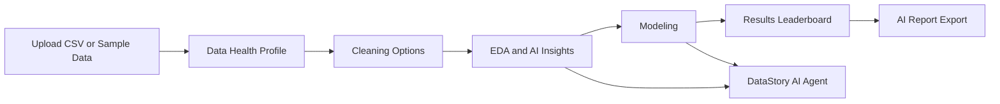
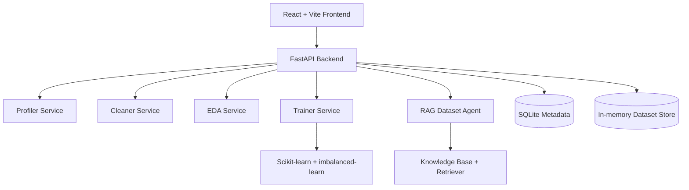

# DataStory AI

DataStory AI is a junior data analyst web app for turning CSV files into a guided analysis workflow. A user can upload or load a dataset, review data health, choose cleaning actions, explore advanced EDA plots, train tuned machine-learning models, compare a leaderboard, ask a RAG-based dataset agent questions, and export a structured report.

## Product Flow

## Main Features

- Dataset profiling: rows, columns, missing values, duplicates, warnings, target suggestions, and health score.
- Cleaning workflow: selected-first cleaning actions with configurable numeric, categorical, text, outlier, and column-level controls.
- Advanced EDA: histograms, categorical plots, missingness, outlier summaries, correlation heatmaps, KDE curves, violin plots, and box plots.
- Modeling: classification and regression model selection with GridSearchCV tuning.
- Imbalance handling: detects classification imbalance and offers SMOTE or class-weighted training.
- Results: task-aware leaderboard that only shows classification metrics for classification and regression metrics for regression.
- DataStory AI Agent: RAG-backed assistant for dataset questions such as imbalance, cleaning choices, EDA warnings, and model interpretation.
- Report export: branded PDF and Markdown reports with generated charts, EDA, model results, insights, recommendations, and technical notes.

## Architecture

## API Overview

| Method | Endpoint | Purpose |
| --- | --- | --- |
| `GET` | `/healthz` | Health check |
| `GET` | `/samples` | List sample datasets |
| `POST` | `/samples/{sample_id}` | Load a sample dataset |
| `POST` | `/upload` | Upload CSV |
| `GET` | `/profile/{dataset_id}` | Dataset profile |
| `POST` | `/clean/{dataset_id}` | Preview/apply cleaning |
| `GET` | `/eda/{dataset_id}` | EDA summaries and plot data |
| `POST` | `/select-target/{dataset_id}` | Task and imbalance detection |
| `GET` | `/models` | Compatible model list |
| `POST` | `/train/{dataset_id}` | Tuned model training |
| `GET` | `/results/{dataset_id}` | Saved model results |
| `POST` | `/chat/{dataset_id}` | DataStory AI dataset agent |
| `POST` | `/report/{dataset_id}` | AI-assisted report generation |

## Tech Stack

| Area | Tools |
| --- | --- |
| Frontend | React, TypeScript, Vite, Tailwind CSS |
| Charts | Plotly |
| Backend | FastAPI, Pydantic |
| Data | Pandas, NumPy |
| Machine Learning | Scikit-learn, imbalanced-learn |
| RAG | Local knowledge base, retriever, optional OpenRouter |
| Storage | SQLite metadata plus active in-memory dataset frames |
